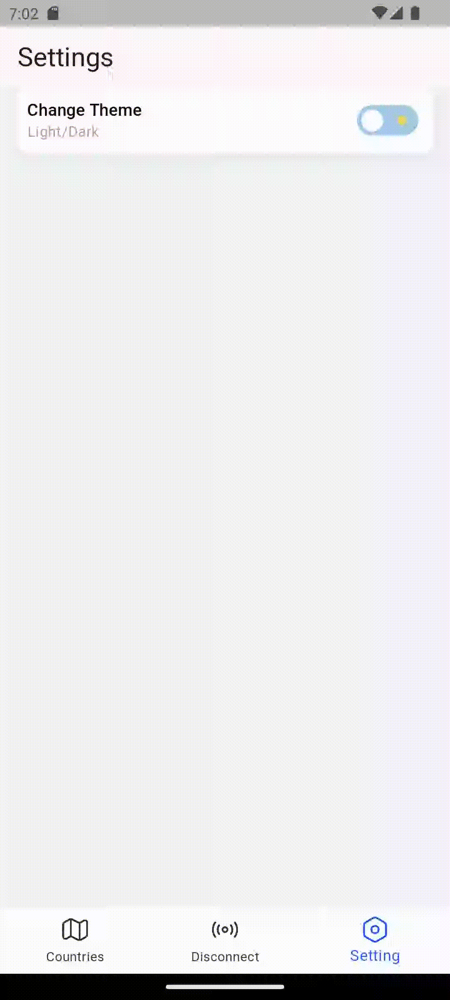
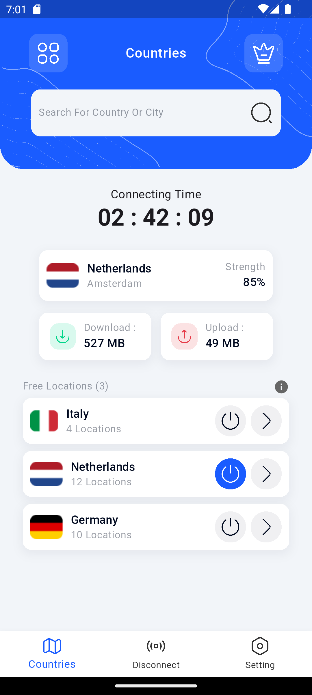
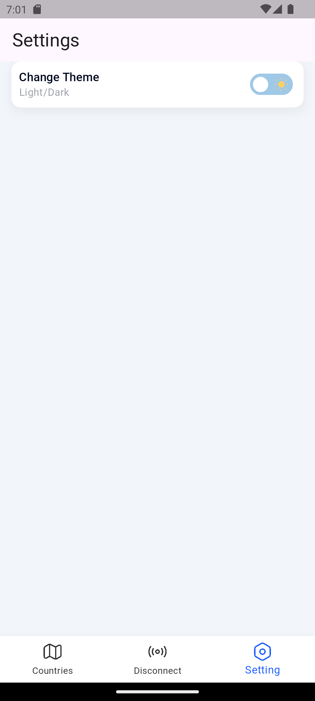
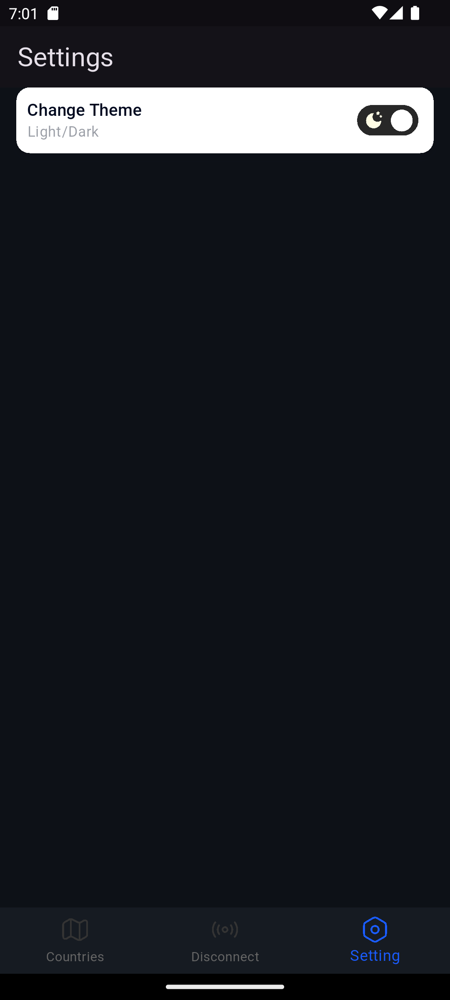
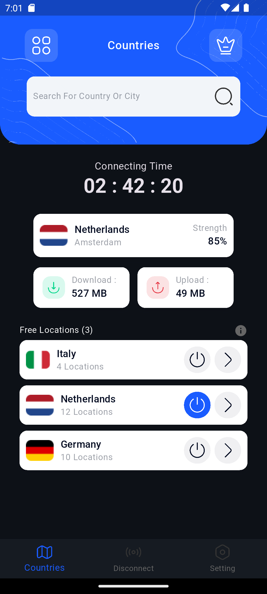
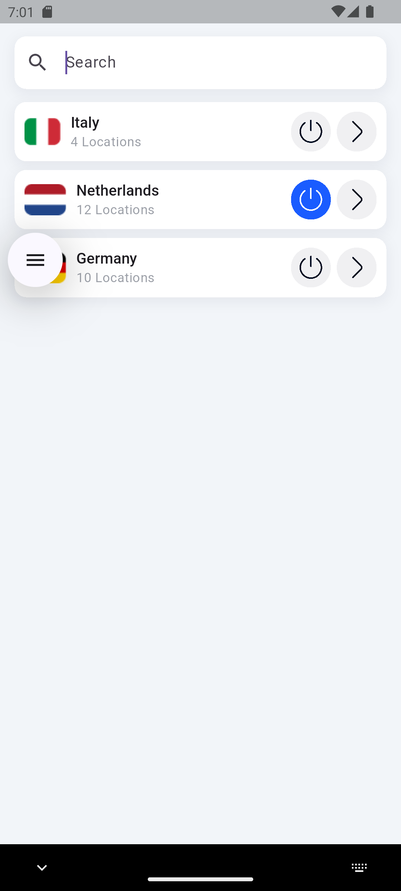

# VPN Uygulaması

## Görüntüler
**GIF ve PNG dosyaları mevcuttur.**

<table>
  <tr>
    <td></td>
    <td></td>
  </tr>
  <tr>
    <td></td>
    <td></td>
    <td></td>
  </tr>
  <tr>
    <td></td>
    <td></td>
  </tr>
</table>

---

## Ön Açıklama
- Proje geliştirilirken MVVM mimarisi ve GetX state management yöntemi tercih edildi.

## Kullanılan Paketler ve Nedenleri

- **http:** Sunucu ile API istekleri yapmak için kullanılır lakin bu projede mock data kullanıldığı için servis fonksiyonunun nasıl olabileceğini göstermek için kullanıldı.  
- **kartal:** Mediaquery ve text temaları için kolay erişimi sağlayan bir paket geliştirme sürecinde kolaylık için kullanıldı.  
- **get:** GetX state management yöntemi için kullanıldı.  
- **flutter_svg:** SVG ikonlar ve grafikler kullanmak için. kullanıldı.  
- **flutter_animate & animations:** Animasyonlar için kullanıldı.  
- **lottie:** Lottie animasyonlarını kullanmak için kullanıldı.  
- **device_preview:** Farklı cihaz ve ekran boyutlarında uygulamanın nasıl göründüğünü test etmek için responsive tasarım testi için kullanıldı.  

---

## Yapı ve Mimari
Uygulama **MVVM (Model-View-ViewModel)** mimarisi ile geliştirilmiştir.

---

main.dart 
core/ 
├── model/ 
│   ├── connection_stats_model.dart 
│   └── country_model.dart 
├── routes/ 
│   ├── pages.dart 
│   └── routes.dart 
├── service/ 
│   ├── vpn_repository.dart 
│   └── vpn_service.dart 
├── theme/ 
│   ├── dark_theme.dart 
│   ├── light_theme.dart 
│   └── theme_controller.dart 
└── util/ 
    └── app_text_styles.dart 

features/ 
├── home/ 
│   ├── view/ 
│   │   └── home_view.dart 
│   ├── viewModel/ 
│   │   ├── home_binding.dart 
│   │   ├── home_state.dart 
│   │   └── home_view_model.dart 
│   └── widget/ 
│   │   └── current_connection_container.dart 
│   │   └── locations.dart 
│   │   └── top_bar_container.dart 
├── navigation/ 
│   ├── view/ 
│   │   └── navigation_view.dart 
│   └── viewModel/ 
│   │   └── navigation_binding.dart 
│   │   └── navigation_state.dart 
│   │   └── navigation_view_model.dart 
├── search/ 
│   ├── view/ 
│   │   └── search_view.dart 
│   └── widget/ 
│   │   └── locations_for_search.dart 
├── settings/ 
│   ├── view/ 
│   │   └── settings_view.dart 
│   ├── viewModel/ 
│   │   └── settings_binding.dart 
│   │   └── settings_state.dart 
│   │   └── settings_view_model.dart 

product/ 
├── constant/ 
│   ├── product_border_radius.dart 
│   ├── product_box_decoration.dart 
│   ├── product_colors.dart 
│   ├── product_input_decoration.dart 
│   ├── product_padding.dart 
│   └── product_strings.dart 
├── extension/ 
│   ├── image_extension.dart 
│   ├── lottie_extension.dart 
│   └── svg_extension.dart 
├── network/ 
│   └── product_network_manager.dart 
├── util/ 
│   └── custom_exception.dart 
│   └── custom_sized_box.dart 
│   └── custom_snackbar.dart 
│   └── product_utils.dart 

## Kurulum ve Kullanım

### Gereksinimler

- Flutter SDK >= 3.7.0  
- Dart SDK >= 2.19.0
- Visual Studio Code veya Android Studio (Tercih ettiğiniz Flutter geliştirme ortamı)  
- Android/iOS cihaz veya emülatör/simülatör
